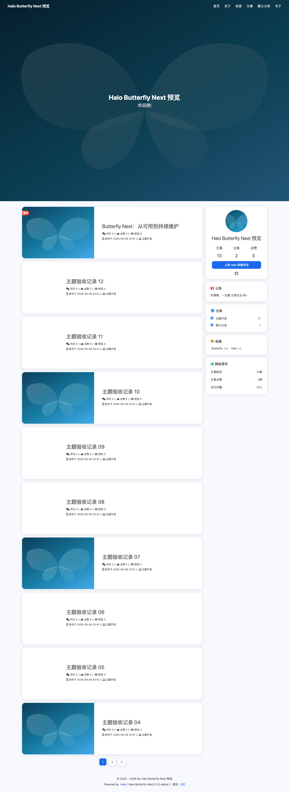
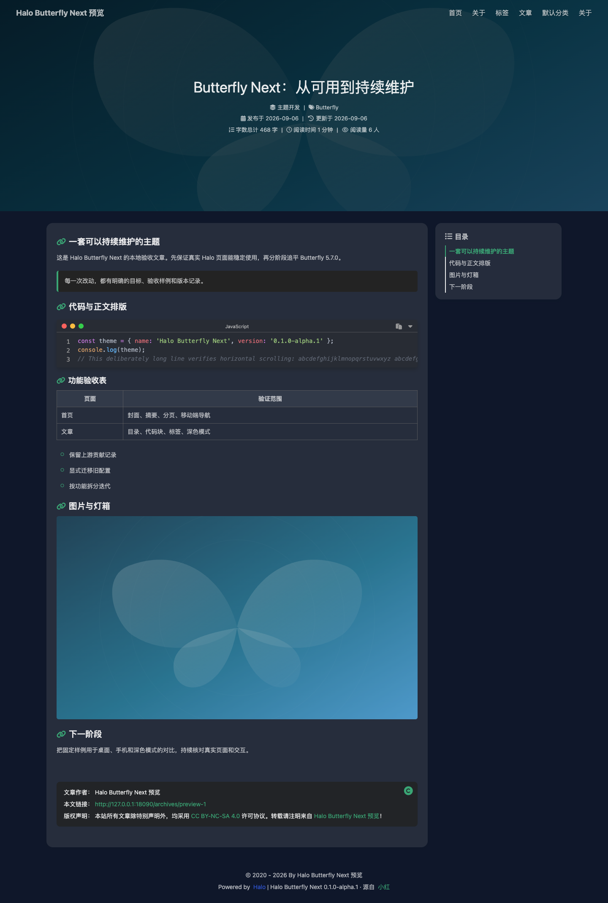
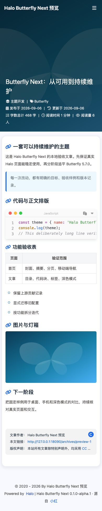

# Halo Butterfly Next

Butterfly 的 Halo 社区维护版，基于 [小红的 Halo 移植项目](https://github.com/dhjddcn/halo-theme-butterfly) 保留完整 Git 历史，分阶段追平 [Hexo Butterfly](https://github.com/jerryc127/hexo-theme-butterfly)。这是独立维护项目，不代表 Halo 或 Butterfly 官方。

当前版本 **0.1.0-alpha.1**：先交付可构建、可安装、可迁移、可验证的维护基础。页面仍以原 Halo 版为基础，**尚未全面对齐 Hexo Butterfly 5.7.0**。具体边界见 [路线与差异清单](docs/ROADMAP.md)。

## 效果预览

以下截图来自 Halo **2.26.1** 的真实运行页面，使用合成测试内容和主题默认封面。当前通过私有仓库提供预览，仓库及安装包仅对获授权的 GitHub 用户可见。



<details>
<summary>展开查看深色文章页</summary>



</details>

<details>
<summary>展开查看手机文章页（390px）</summary>



</details>

## 安装

首轮实际验证 Halo **2.26.1**。兼容声明限定 `>=2.26.1 & <2.27.0`，其他 2.26 补丁版仍需实际验证。请先在测试站使用 alpha 版本。

在 [0.1.0-alpha.1 预览发行页](https://github.com/songxychn/halo-butterfly-next/releases/tag/v0.1.0-alpha.1) 下载 `halo-butterfly-next-0.1.0-alpha.1.zip`，在 Halo 控制台的主题管理中上传、配置并启用。主题 ID 为 `halo-butterfly-next`；可与原 `theme-butterfly` 同时安装。请下载主题 ZIP 附件，GitHub 自动生成的 Source code 压缩包不包含构建后的模板。

原主题用户先阅读 [配置迁移说明](docs/MIGRATION.md)。不要覆盖原主题目录，也不要直接套用旧主题的 ConfigMap。

## 构建与检查

需要 Node.js 24 与 pnpm 11.19.0：

```bash
pnpm install --frozen-lockfile --ignore-scripts
pnpm verify
```

安装包位于 `dist/`。源码在 `src/`；`templates/` 和 `dist/` 是生成物。`pnpm dev` 可监听源码重建，`pnpm build` 可单独构建。构建包含全部页面 JS/CSS、四种 Loading、图标、内置封面及许可证，不依赖原主题 CDN。

对已安装的真实 Halo 做基础 HTTP 检查：

```bash
node scripts/smoke.mjs --base http://127.0.0.1:8090
# 根据测试站的真实路由补充文章、自定义页及分页：
node scripts/smoke.mjs --base http://127.0.0.1:8090 --routes /,/page/2,/archives/your-post,/about
```

HTTP 检查不等同于视觉和交互验收。维护流程见 [CONTRIBUTING.md](CONTRIBUTING.md)，首轮证据见 [验收记录](docs/VALIDATION.md)。远程构建及重复构建检查见 [GitHub Actions 运行记录](https://github.com/songxychn/halo-butterfly-next/actions/workflows/verify.yml)。

## 当前能力与默认行为

- 保留首页、文章、归档、分类、标签和自定义页面；原友链、图库、瞬间模板尚待插件集成验收。
- 搜索与评论使用 Halo 对应插件。插件停用时隐藏相关入口，手机菜单仍可使用。
- 作者用户名留空时显示站点信息；无需存在名为 `admin` 的用户。
- 默认使用系统字体和本项目原创 SVG 封面；随机图片和随机文案 API 默认关闭。
- 深色模式使用主题独立的存储键；资源与配置使用独立主题标识。
- canonical 和 Open Graph 可在基本设置中关闭，描述/关键词交由 Halo 输出。
- Halo 2.26 新的插件页面公共布局尚未实现，详见差异清单。

## 致谢与许可

主题代码沿用 [GPL-3.0](LICENSE)。保留原 Halo 移植作者小红及历史贡献者的署名，外观与功能对齐目标来自 JerryC 的 Hexo Butterfly。

安装包已替换继承的 Font Awesome Pro、旧字体与旧默认照片，改用 Font Awesome Free、系统字体和原创 SVG。第三方资源及许可证说明见 [THIRD_PARTY.md](docs/THIRD_PARTY.md)。原始资源仍可在上游 Git 历史中找到，保留历史不等于为这些资源重新授权。
