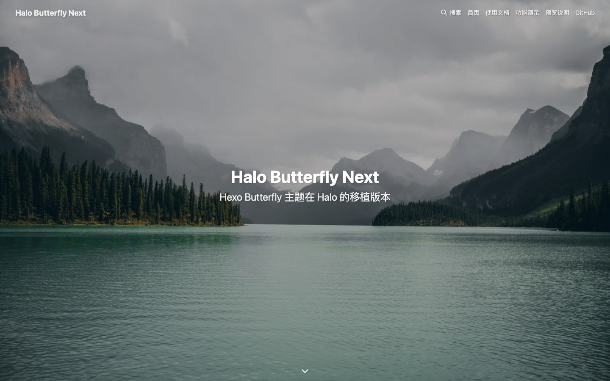
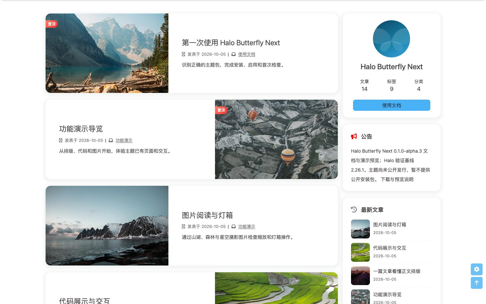
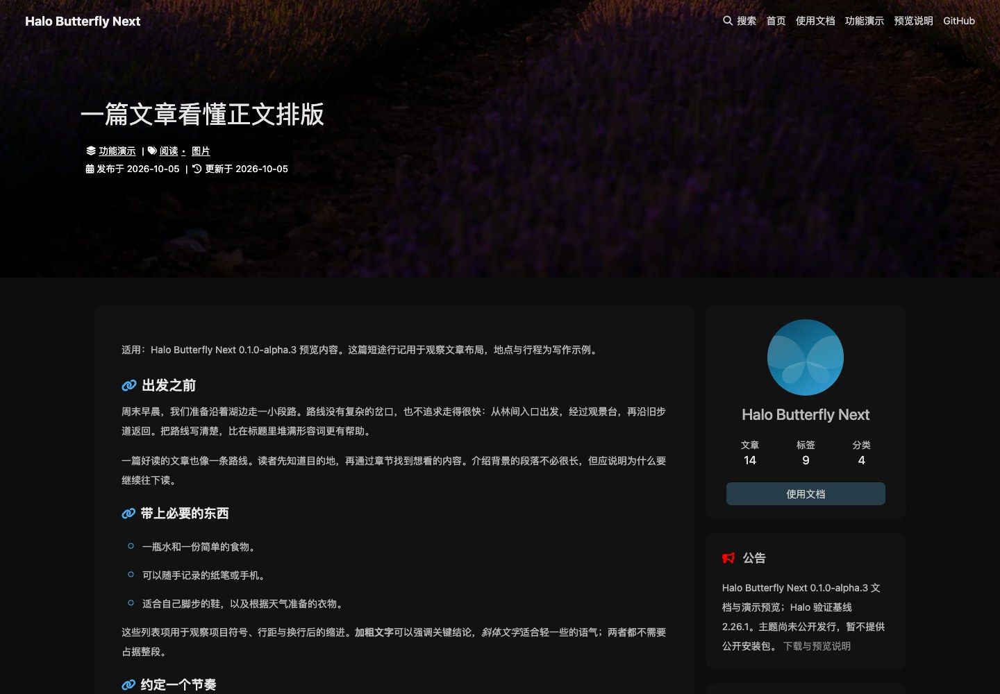
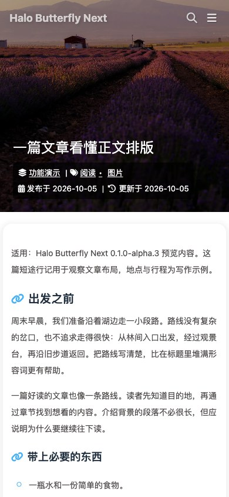

# Halo Butterfly Next

Butterfly 的 Halo 社区维护版，继承[小红的 Halo 移植项目](https://github.com/dhjddcn/halo-theme-butterfly)，分阶段对齐 [Hexo Butterfly](https://github.com/jerryc127/hexo-theme-butterfly)。这是独立维护项目，不代表 Halo 或 Butterfly 官方。

[在线演示](https://butterfly.baizhukui.com/) · [使用文档](https://butterfly.baizhukui.com/docs) · [功能演示导览](https://butterfly.baizhukui.com/archives/demo-guide)

**[0.1.0-alpha.4 发行入口](https://github.com/songxychn/halo-butterfly-next/releases/tag/v0.1.0-alpha.4)。** 这一版本面向测试站试用，尚未全面对齐 Butterfly 5.7.0，也不是稳定 1.0。安装包、对应源码、校验摘要及已知限制见[发行说明](releases/v0.1.0-alpha.4.md)。

## 页面预览

以下截图采自 [在线演示站](https://butterfly.baizhukui.com/)（2026-10-05，Halo 2.26.1），展示默认全屏首页、摄影封面卡片及正文的亮暗配色。





| 文章桌面暗色 | 文章手机宽度亮色 |
| --- | --- |
|  |  |

截图保留 2026-10-05 预览站的采集时间，使用独立无头 Chromium；手机宽度预览不代表实机验收。当前站点按 Release 更新，与 master 开发源码可能不同；机制见[H2 演示站说明](site/demo/README.md)，alpha.3 的实际发行包与部署核验见[发布完成记录](docs/validation/2026-10-06/alpha3-publication.md)。

## 安装与支持范围

当前源码的最低 Halo 版本为 **2.20.2**，主题元数据声明 `>=2.20.2`，不设上限。官方 **2.20.2 / 2.20.10 / 2.20.21 / 2.21.10 / 2.22.14 / 2.23.3 / 2.24.2 / 2.25.4 / 2.26.0 / 2.26.1** 已完成限定范围的核心兼容检查；**2.27.0-beta.1** 的预发布结果单独登记，具体场景与限制见[兼容验证记录](docs/validation/2026-10-08/halo-earlier-compatibility.md)。声明不代表未发布版本或所有插件组合均已验证。2.19.3 的当前默认核心场景存在模板错误，2.20.0/2.20.1 的全新初始化与登录检查未通过，失败记录单列；2.20.2 首次初始化的并发异常也保留。已发布 alpha.3 的元数据及历史验收保持原样。

搜索入口兼容基线仍为官方 **SearchWidget 1.7.1**，alpha.4 集成验收固定 **1.8.0**，建议升级以获得关闭焦点恢复修复；1.8.0 要求 **Halo ≥2.26.0**。评论入口及实测基线为官方 **CommentWidget 3.3.2**，也要求 **Halo ≥2.26.0**；较低 Halo 版本不提供该评论入口。仅承诺已登记的测试组合，未承诺未来版本组合。插件缺失、停用或低于入口基线时隐藏对应入口。文章及卡片评论数默认关闭。公共插件页面布局契约从 Halo 2.26.0 提供，不影响较低版本的主题核心页面。alpha.3 的历史实测使用搜索 1.7.1；alpha.4 demo 随版本构建为 1.8.0。

在 [alpha.4 发行页](https://github.com/songxychn/halo-butterfly-next/releases/tag/v0.1.0-alpha.4)下载 `halo-butterfly-next-0.1.0-alpha.4.zip`，核对 SHA-256 后通过 Halo 控制台主题管理上传、配置并启用。主题 ID 保持 `halo-butterfly-next`。GitHub 自动生成的 Source code 压缩包是构建源码，不能直接作为主题 ZIP 安装。

- [安装、备份、同 ID 升级及回退](docs/INSTALL-UPGRADE.md)
- [从原 theme-butterfly 迁移](docs/MIGRATION.md)
- [alpha.4 发行说明](releases/v0.1.0-alpha.4.md)
- [应用市场上架差距与派生说明](docs/APP-STORE-READINESS.md)（首次审核暂未通过，整改中，尚不具备重新提交条件）

版本发行与发布后 demo 更新流程见[发布说明](releases/README.md)和[H2 演示站机制](site/demo/README.md)。

完整更新见[变更记录](CHANGELOG.md)。最终安装包的整体验收状态以发行说明中绑定的包身份与证据为准。

## 已知限制

- alpha.3 固定 SearchWidget 1.7.1 通过 Escape 或遮罩关闭后，焦点不会返回搜索入口，键盘用户需重新使用 Tab 导航。官方 1.8.0 已修复，集成回归见[搜索焦点验收](docs/validation/2026-10-08/search-widget-1.8.md)。旧版失败和 alpha 例外继续保留，完整无障碍与 1.0 门禁不豁免；alpha.4 demo 使用 1.8.0。
- 默认开启 `mask.header` 时，明亮或白色顶图上的导航、站名和首页大标题仍可能对比不足；关闭遮罩也不能保证可读性。维护者已决定保留 Butterfly 默认样式，作为本次 alpha 已知限制披露。建议选择文字区域较暗的封面并检查可读性；不宣称任意图片/遮罩组合均符合可访问性要求。
- Halo 2.26.1 的原生连接测试仍出现静态资源无响应和页面就绪超时，涉及 macOS Firefox、插件导航及 Linux 浏览器测试，可能影响页面加载。维护者已将 #338 作为 Halo 上游已知限制接受，不再阻塞本次 alpha 发行；原始失败继续保留，详见[资源加载裁定](docs/RESOURCE-LOADING-DECISION.md)。
- alpha.3 历史候选 Lighthouse 模拟手机首页、长文的 LCP 中位数分别为 6.95 秒、4.66 秒，每组 5 次冷浏览器测量；均未达到 2.5 秒目标。这不是实机等待时间或性能达标声明，完整性能合同仍未完成。
- 自定义 CSS、第三方代码高亮主题和用户额外注入代码可能改变颜色、焦点或布局，不包含在默认配色的通过范围中。
- 友链、图库、瞬间和正文扩展，以及完整插件生态仍按各自证据标注实验性或未验证；有模板不等于已经通过端到端验收。Hexo 的 `` 标签不能直接在 Halo 中解析。
- 无头 Chromium/Firefox/WebKit 与手机宽度测试不能替代实际 Safari、真机触摸/软键盘或屏幕阅读器。真实 Safari、真实手机、完整性能合同和完整 1.0 验收尚未完成。

测试反馈请附主题/平台/插件版本、浏览器与复现步骤，并先移除日志中的 Cookie、Token、密码、个人信息和私有站点配置。不要上传数据库或凭据文件。

## 源码与构建

需要 Bun 1.4.0，以及 Python 3（本地守卫检查）。Bun 负责依赖管理、脚本执行和测试运行；当前源码不要求安装 Node.js。使用 `bun run build`，避免与 Bun 自带的 `bun build` 打包命令混淆。

```sh
bun install --frozen-lockfile --ignore-scripts
bun run verify
```

输出 `dist/halo-butterfly-next-0.1.0-alpha.4.zip`。源码在 `src/`；`templates/` 与 `dist/` 为生成物，不手工修改。详见[对应源码与构建说明](docs/SOURCE-BUILD.md)、[双站实验室](docs/COMPARISON-LAB.md)和[贡献流程](CONTRIBUTING.md)。无服务 CI 通过不能替代真实 Halo 安装与插件交互验证。

## 许可与后续计划

主题沿用 [GPL-3.0](LICENSE)，保留小红及历史贡献者署名；其他组件许可见[第三方资源说明](docs/THIRD_PARTY.md)和[改写来源清单](third-party-licenses/UPSTREAM-ATTRIBUTION.txt)。旧 Font Awesome Pro、旧字体和旧默认照片不属于当前安装包；公开范围不为旧历史资源追加授权。

[公开 alpha 计划](docs/PUBLIC-ALPHA.md)、[完整功能矩阵](docs/parity/MATRIX.md)和[1.0 验收合同](docs/RELEASE-ACCEPTANCE.md)继续保留各项未完成状态。

自维护浏览器代码统一使用 TypeScript（`src/js/**/*.ts`、`src/plugins/loading/*.ts`），运行 `bun run typecheck` 做严格类型检查；`bun run verify` 已包含此步骤。Bun 直接执行测试引用的 TypeScript，测试使用 `bun:test` 并隔离各文件的全局环境；类型检查仍由 `tsc --noEmit` 独立完成。第三方压缩库保留 JS，使用声明文件描述调用边界。模板只注入 Halo 数据，首屏逻辑由 `src/js/bootstrap.ts` 构建后同步内联，页面资源仍输出原有 `.min.js` 文件名。
