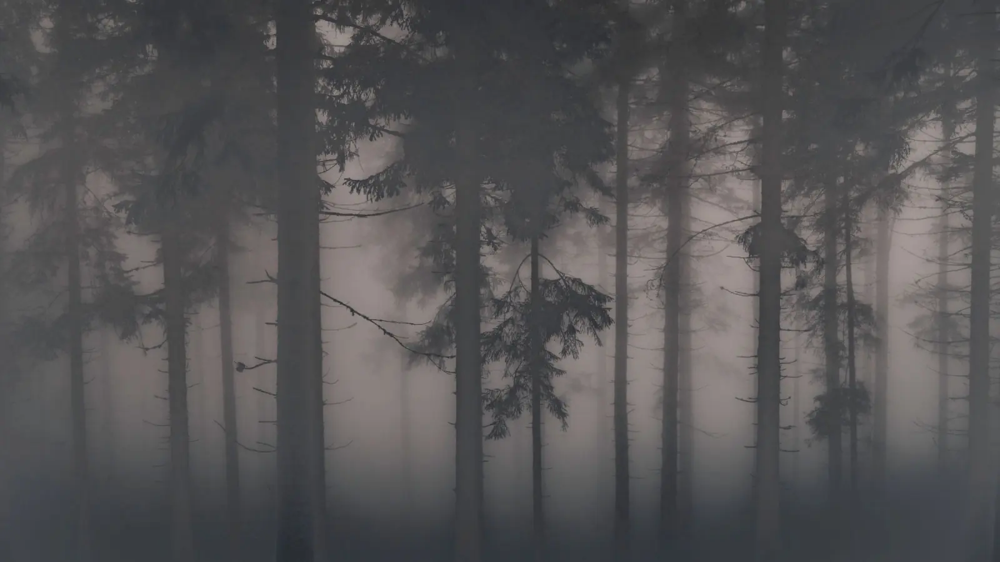
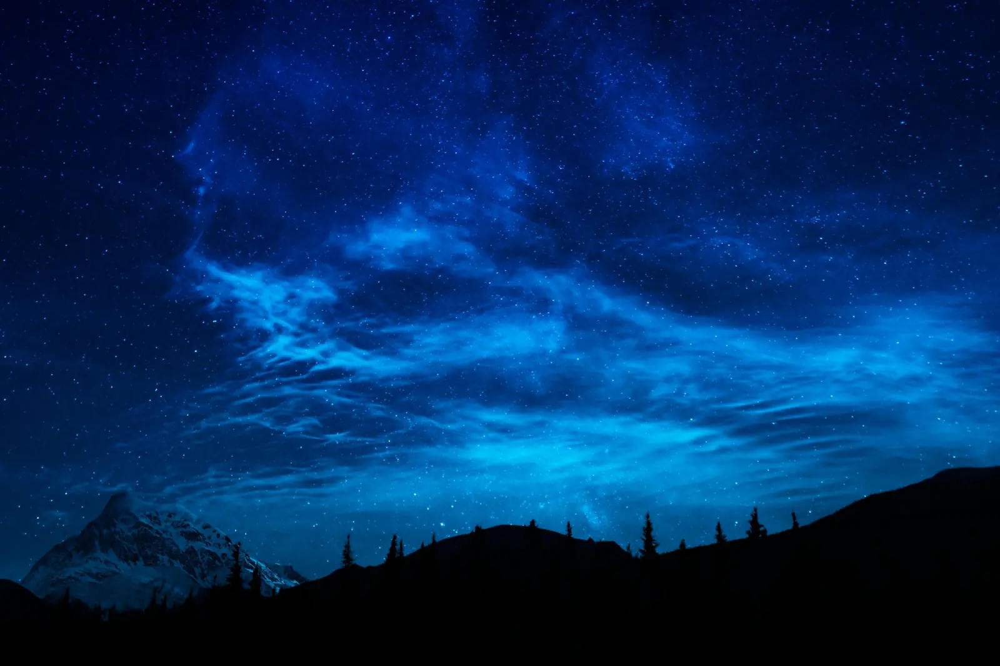

# 图片阅读与灯箱

适用：Halo Butterfly Next 0.1.0-alpha.3 预览内容。这里使用来自 Pexels 的摄影图片，图片保存在样站本地，浏览时不依赖外部图片服务。

## 横向风景

这张横向照片适合观察正文宽度和放大后的显示。打开后试着缩放、恢复原尺寸，再切换到下一张。

## 雾中森林

森林照片用于检查手机与桌面视口的适配。图片应在可用空间内显示，工具栏不应遮挡关闭入口。

## 另一种层次

第三张照片采用深色背景。切换网站的深浅色模式，再观察图片边缘和说明文字。

## 试着完成一次操作

1. 点击第一张图，确认灯箱打开。
2. 切换到第二张，再缩放或旋转图片。
3. 使用重置按钮恢复显示。
4. 按 Escape 关闭，检查焦点是否回到打开灯箱的图片。

若开启了幻灯片播放，Escape 会先停止播放，再次按下才关闭。手机上的手势操作应以实际设备检查为准。

这些图片默认属于同页集合。更复杂的图片分组与导航链接处理，见[图片与灯箱教程](../tutorials/images.md)。素材来源和站点复现方式见[演示站配置](../pages/site-setup.md)。
